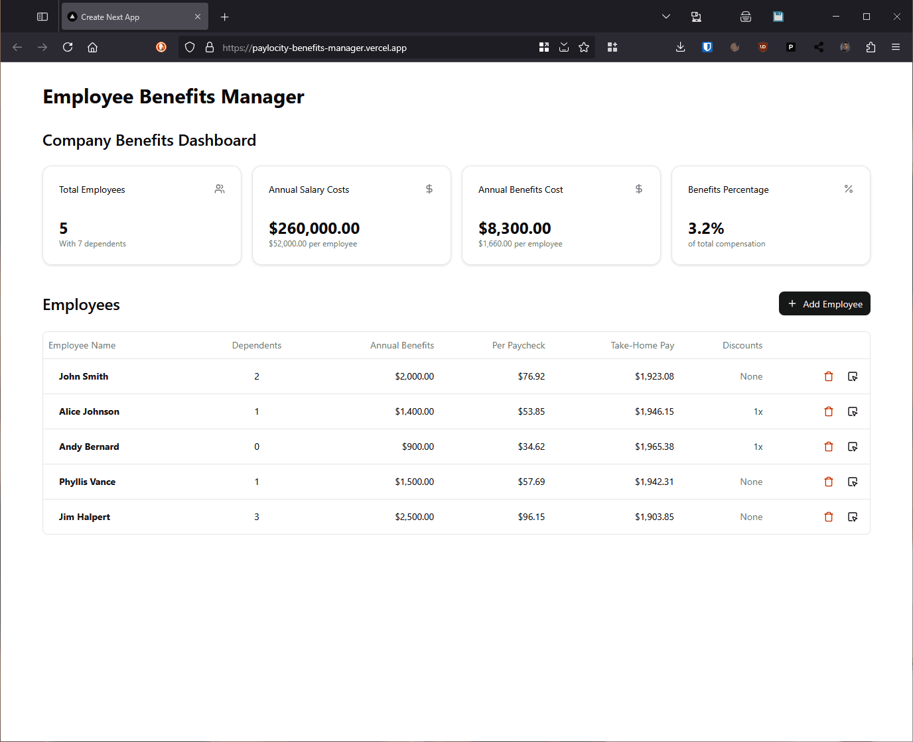

# Employer Benefits Manager

Live demo: <https://paylocity-benefits-manager.vercel.app/>

This is a Next.js application with a demo app for managing and reviewing employee benefits. It uses shadcn/ui components (with Tailwind CSS).



## Notes for Reviewers

### Overview of Time Spent

| Task                  | Time       | Notes                                                                                                                                                                                                                                                                                                                                                                |
| --------------------- | ---------- | -------------------------------------------------------------------------------------------------------------------------------------------------------------------------------------------------------------------------------------------------------------------------------------------------------------------------------------------------------------------- |
| Design Planning       | 15 minutes | Initially I was planning to use a grid of cards for each employee, with a collapse/expand section in each card to show dependents and/or benefit details. I pivoted to using a table with drawers instead, which I think is the better design. I intentionally designed with shadcn/ui components in mind to simulate having a design/component system to work with. |
| Computation Utilities | 5 minutes  | I used a GPT to generate the calculation utilities based on your requirements. I should have used it to generate some tests as well. That's a big miss on my part.                                                                                                                                                                                                   |
| CRUD Context          | 15 minutes | I had planned to use server actions to manipulate a JSON file, but doing it that way would have doubled the time to mock out the CRUD operations. Using React context felt like a good middle ground.                                                                                                                                                                |
| UI Development        | 2 hours    | I ran into some issues with Next.js 15 using Turbopack in dev mode, which definitely slowed me down a bit. Using shadcn/ui made much of the individual pieces pretty straight-forward, though, so I think it balanced out.                                                                                                                                           |
| Documentation         | 30 minutes | I added in some TODOs and comments, and I also made this README, just so that we had a good starting point for follow-up conversations.                                                                                                                                                                                                                              |

### Things I Would Do Next

1. Explore moving the inline forms (especially for editing dependents) into modals, or condense them down to better fit into the space vertically so the layout doesn't shift as much
2. Expose the discount information inline for dependents (likely next to the relationship badges)
3. Get rid of some state (`useState`) where possible
    - Especially for showing the employee drawer, I **really** should have used a query param to set the employee ID in the URL used that to show/hide the drawer
4. Add in some tests
    - Since I'm working as if I don't control the base components, I wouldn't test those, but either the `company-context` or the `employee-table` would be good places to start  
5. Mobile view for the employee-table, likely collapsing/hiding some columns
6. Pagination for the employee-table
7. Add charts/graphs to the company dashboard

* * *

### Running Locally

First, install dependencies:

```bash
npm install
```

Then, run the development server:

```bash
npm run dev
```

Open [http://localhost:3000](http://localhost:3000) with your browser to see the result.

* * *

### Coding Challenge Overview

Each of our product teams operates like a small startup, empowered to deliver business value in whatever way they see fit. Because our teams are close knit and fast moving it is imperative that you are able to work collaboratively with your fellow developers. This coding challenge is designed to allow you to demonstrate your abilities and discuss your approach to design and implementation with your potential colleagues. You are not expected to spend more than a few hours on this project, and you are free to use whatever technologies you prefer but please be prepared to discuss the choices you've made.

The most important part of this challenge is to use your work as a jumping off point for a broad and deep
conversation with our developers. We are expecting candidates to typically spend few hours on this exercise, and we realize that this may lead to an incomplete implementation. Please take this as an opportunity to demonstrate the best of your abilities - feel free to mock out or skip pieces of the implementation and focus your time on exactly what you'd like to show us. We're not looking for you to give up your weekend for this project, we want something to start a meaningful conversation.

#### Business Need

One of the critical functions that we provide for our clients is the ability to pay for their employees' healthcare benefits package. A portion of these costs are deducted from their paycheck, and we handle that deduction. Create a front-end application that displays the total cost of their healthcare benefits package per paycheck.

#### Calculation breakdown

- The cost of benefits is $1000/year for each employee
- Each dependent (children and possibly spouses) incurs a cost of $500/year
- Anyone whose name starts with 'A' gets a 10% discount, employee or dependent

#### Assumptions

- All employees are paid $2000 per paycheck before deductions.
- There are 26 paychecks in a year.

#### Requirements

- Mock out an API for the retrieval of employee/dependent data
  - Tip: All data can be stored client-side in memory
- List out the employee and their dependents
- Allow the user to change their elections and display a preview of the calculated benefits
- CRUD functionality
  - i.e. Add/edit employee + dependents
- Allow the user to save their changes and reflect them on subsequent page loads

##### Don't waste your time on

- Implementing a backend, data-access layer, etc.
- Perfect UI/UX design, though a general knowledge should be shown

##### Delivery of solution

- Please include instructions on how to run the application in your submission.
- You are not expected to spend more than a few hours on this project, and you are free to use whatever
technologies you prefer but please be prepared to discuss the choices you've made. The most important part of this challenge is to use your work as a jumping-off point for a deeper conversation with our developers.